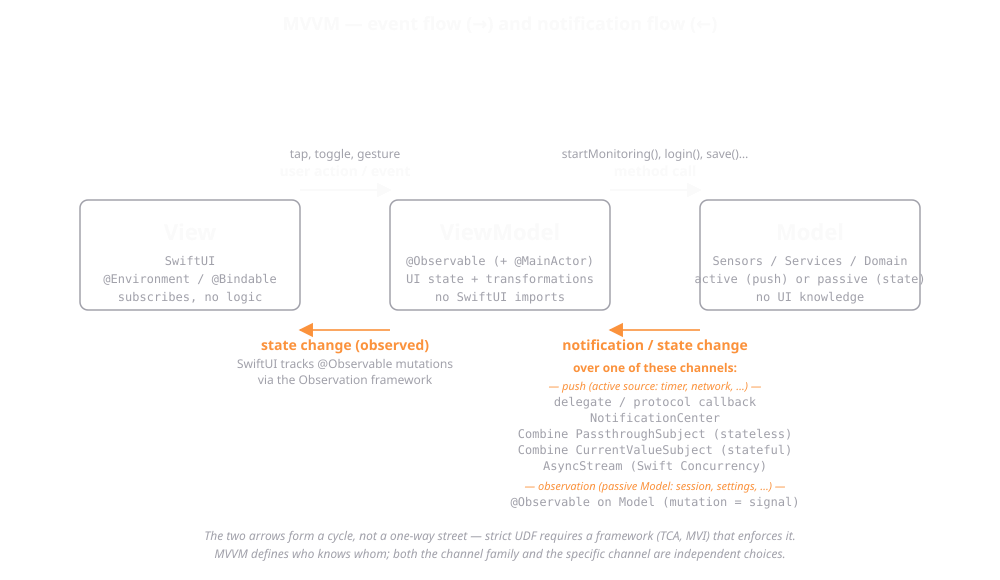

[© Alexander Voß, FH Aachen, codebasedlearning.dev](mailto:info@codebasedlearning.dev)

# iOS Course – Apps


## Unit 0x02

> In this unit we look at the application architecture and in particular the Model-View-ViewModel (MVVM).


## MVVM

MVVM is a design pattern that helps you separate concerns in your app, making your code more modular, testable, and reusable. 



Let's sxtart with a brief characterisation of what is what.


### MVVM is an *architectural* pattern (and what that means)

MVVM is an **architectural pattern**. It defines *who knows whom*: View → ViewModel → Model.
It does **not** prescribe *how* the layers exchange data.

That distinction matters because in this unit we look at several different *communication mechanisms* between Model and ViewModel — delegate / callback, NotificationCenter, Combine (Passthrough- and CurrentValueSubject), AsyncStream — and they are all **orthogonal to MVVM**. The same set of mechanisms shows up in MVC, MVP, VIPER, or TCA. So when we say "the MVVM way" of doing things, we are really making two independent choices:

1. **Architecture** – Which layers exist and which arrows are allowed? (Here: MVVM.)
2. **Notification mechanism** – Over which channel does a lower layer hand new data to the upper one? (Here: pick one of delegate / NotificationCenter / Combine / AsyncStream.)

A second clarification: the **variety of model objects** discussed further down (Domain, DTO, UI Model, Persistence Model) is also orthogonal to MVVM. Those are categories of data objects you'll meet in any layered architecture — MVVM just happens to be the architecture we are using to talk about them.

> Slogan: *MVVM tells us who talks to whom. It does not tell us which channel they use.*

What MVVM does *not* tell you:
- How to navigate between screens (that's a Coordinator / NavigationStack question).
- Where networking and persistence live (Repository / Service layer).
- Whether the data flow is strictly unidirectional (it isn't, in SwiftUI — see below).

And — gentle warning before you invent `FatViewModel.swift` — a ViewModel is *not* the place for: network code, persistence logic, navigation, or domain rules that belong on the Model. Keep it busy with **UI state and the transformations needed to produce it**, and delegate the rest.


### Model

This is your data layer. It knows nothing about the UI. 
Example:

```
struct User: Identifiable, Codable {
    let id: UUID
    let name: String
    let email: String
}
```

- Knows about: Just itself or other models it needs.
- Should NOT know about: ViewModel or any UI. No SwiftUI imports here.
- It’s the data vault. Quiet, solid, dependable.


### View

This is what the user sees. It presents data and sends user input to the ViewModel.
Example:
```
struct TicTacToeView: View {
    @Environment(TicTacToeViewModel.self) private var game
    
    var body: some View {
        LazyVGrid(columns: columns, spacing: 10) {
    ...
}
```

- Knows about: Only the ViewModel.
- It binds to observable properties exposed by the ViewModel using @Bindable (Swift 5.9+) or @ObservedObject / @StateObject in earlier versions.
- It doesn’t reach behind the curtain to poke at the models or services directly.


### ViewModel

This is where the magic happens. It takes the Model, processes it, and prepares it for display in the View. It also handles user actions and talks to services or use cases.

Example:
```
@Observable
class UserViewModel {
    var user = "Bob"
    ...
}
```

- Knows about:
    - Models (e.g., HeartbeatSensor)
    - Services (e.g., networking, persistence)
- Doesn’t know about: 
    - Specific Views. It just exposes properties the View might bind to.


### “Who Knows Who?” in MVVM

| Component | Knows about          | Should not know about                    |
| --------- | -------------------- | ---------------------------------------- |
| Model     | Itself, other models | ViewModel, View                          |
| ViewModel | Models, Services     | View (in a tight way—more on that below) |
| View      | ViewModel            | Model (directly), Services               |

> View knows about View Model, View Model knows about Model, Model knows nothing


| Layer     | Owns the truth of           | Observable? | Bound to View?   |
| --------- | --------------------------- | ----------- | ---------------- |
| Model     | The real world / data layer | Maybe       | no               |
| ViewModel | The current UI state        | yes!        | yes              |
| View      | Just presents the truth     | N/A         | yes (subscribes) |


### The Data-Flow Cycle in SwiftUI

User Input → View (binds to) → ViewModel (calls/uses) → Model → (observed by) ViewModel → View

The cycle:
- User interacts with the View, e.g., taps a button.
- The View calls a method on the ViewModel.
- The ViewModel mutates state or talks to the Model.
- The Model returns data or triggers a change, or the ViewModel observes the data changes from the Model and updates its own data.
- The ViewModel updates its observable properties.
- SwiftUI observes those changes and automatically re-renders the View.


### A note on "Unidirectional Data Flow" (UDF)

The arrow diagram above is sometimes called *unidirectional data flow*, but it is really a **cycle**: events go one way (View → ViewModel → Model), and *state changes propagate back the other way* (Model → ViewModel → View). In Elm / Redux / TCA the same idea is drawn as a loop and called UDF without controversy.

Where SwiftUI bends the strict UDF rule:
- `@Binding` writes from the View directly back into ViewModel state — that is by design *bi*directional. A `Toggle("", isOn: $vm.isOn)` mutates the VM as the user flicks the switch, without an explicit "action".
- `@State` inside a View is also writable from the body, which is fine for purely-local UI state but blurs the picture if you squint at it.

If you want **strict** UDF — every state change goes through a single `(State, Action) -> State` reducer — you reach for an opinionated framework that enforces that constraint, not for "MVVM done carefully". On iOS the canonical choice is **TCA (The Composable Architecture)** by Point-Free; on Android the equivalent is **MVI (Model-View-Intent)**. Both are descendants of Elm.

> So: MVVM in SwiftUI is best described as a *unidirectional **cycle*** with a small bidirectional shortcut where bindings happen. For a first course that is exactly the right level of nuance.
    

### Models

There are many 'models'. Here are a few.


#### Domain Models

Represent real-world concepts, business logic, or core app data.
- Examples: HeartbeatSensor, User, Invoice, TemperatureReading.
- Behavior-focused, not just data holders.
- May contain validation, business rules, or simulation logic.

Swift Trait: Usually struct or class.


#### Data Transfer Objects (DTOs)

Data shaped for transport, not behavior.
- Examples: JSON responses, REST payloads
- Purely structural: just properties, no methods
- Often maps to/from domain models
    
Swift Trait: struct, always Codable


#### UI Models / View Data Models

Lightweight structs tailored for display in a View.
- Examples: UserRowViewModel, ChartDataPoint, FormattedDateModel
- Derived from domain or ViewModel logic
- Decouple the View from deep ViewModel knowledge
    
Swift Trait: struct, not observable


#### Persistence Models (e.g., Core Data / SwiftData)

Data shaped to fit the persistence framework.
- May include Core Data annotations or property wrappers
- Can often be converted to/from domain models

Swift Trait: class, framework-managed


#### Bonus: “Models” in ML or Algorithms

You might also see 'model' refer to a machine learning model, or the state representation in an algorithmic system (e.g., A-star search model, simulation model, etc.)


| Model Type        | Purpose                | Where It Belongs         |
| ----------------- | ---------------------- | ------------------------ |
| Domain Model      | Business logic         | Core app logic           |
| DTO               | Transport-only         | Networking / data layers |
| UI Model          | Data formatted for UI  | ViewModel / View layer   |
| Persistence Model | Storage representation | Persistence (Core Data)  |


## Model → ViewModel notification mechanisms

Within MVVM the Model needs *some* way to tell the ViewModel "new data arrived". `ModelsApp` shows the five most common ones side by side, so students can compare them directly.

| Sensor          | Mechanism                       | Type-safe | Lifecycle-managed | Multi-subscriber |
| --------------- | ------------------------------- | --------- | ----------------- | ---------------- |
| Heartbeat       | Delegate / protocol callback    | Yes       | Manual (weak ref) | No (one slot)    |
| Temperature     | NotificationCenter              | No        | Manual            | Yes (global)     |
| Power           | Combine `PassthroughSubject`    | Yes       | Yes (Cancellable) | Yes              |
| Humidity        | `AsyncStream` (Swift Concurrency) | Yes     | Yes (Task cancel) | No (single iter) |
| Battery         | Combine `CurrentValueSubject`   | Yes       | Yes (Cancellable) | Yes (+ initial)  |

A few rules of thumb:

- **Delegate** is the lightest, oldest, most "Apple-idiomatic" option. Use it when there is exactly one consumer.
- **NotificationCenter** is global and stringly-typed. Use it sparingly — usually only when the publisher and subscriber genuinely have no other way to find each other.
- **Combine `PassthroughSubject`** is the canonical "event stream" with no state. A subscriber that joins late misses earlier events.
- **Combine `CurrentValueSubject`** is the canonical "state stream". A subscriber that joins late immediately gets the current value, then every subsequent one. Perfect for UI that should never see a brief "no data" gap.
- **`AsyncStream`** is the Swift Concurrency equivalent of a Subject: type-safe, cancellation-aware, and lives in `for await … in`. In Swift 6 this is the direction Apple is steering everyone. It is single-consumer by default — for fan-out you need `AsyncBroadcastSequence` from `swift-async-algorithms`.

Other mechanisms you'll meet in the wild but that aren't in `ModelsApp`:

- **`@Published` + `ObservableObject`** — the pre-iOS 17 idiom, still ubiquitous in older codebases.
- **`@Observable` on the Model directly** — iOS 17+ Observation framework. The View could in principle observe `sensor.lastSensorData` without a VM in between. Powerful, also a great way to wave goodbye to your layering.
- **KVO** — legacy from Objective-C; lives on `NSObject` subclasses.
- **Closure callback (`var onValue: ((Int) -> Void)?`)** — the lo-fi delegate. One event, no protocol overhead.
- **`NSFetchedResultsController` / SwiftData `@Query`** — persistence-driven reactive data.
- **Third-party reactive frameworks** — RxSwift, ReactiveSwift.


## View lifecycle wiring

`HeartbeatView`, `TemperatureView`, and `PowerView` are **user-driven**: a `Toggle` decides when `startMonitoring()` / `stopMonitoring()` runs. `HumidityView` and `BatteryView` are **lifecycle-driven**: monitoring is tied to the View being on screen.

Three flavours to know:

| Pattern                        | When it fires                          | Cleanup           |
| ------------------------------ | -------------------------------------- | ----------------- |
| `.onAppear` / `.onDisappear`   | Every entry/exit of the view hierarchy | Manual (in `.onDisappear`) |
| `.task { … }`                  | View entry; async block                | Automatic (Task is cancelled on exit) |
| `.task(id: someValue) { … }`   | View entry + whenever `id` changes     | Automatic, plus restart on change |

`.task` is preferred whenever the work is itself async (URLSession, AsyncStream consumers) or the VM offers an async entry point — you get structured-concurrency cleanup for free. For plain synchronous start/stop you can stay with `.onAppear`/`.onDisappear`.

Gotchas worth flagging to students:

- `.onAppear` fires **every** time the view enters the hierarchy, including coming back from navigation. Idempotent start logic matters.
- `.onDisappear` is **not** the same as `deinit` — the view may merely be hidden by a tab change.
- SwiftUI may build a view's body without it being on screen (preview, layout). Don't put side effects in `body`.


## Other Architecture

The Composable Architecture (TCA) is a Swift architecture library by Pointfree. 
It is not a SwiftUI feature — it's an opinionated framework you import on top of SwiftUI. 
The mental model is borrowed from Elm and Redux, retrofitted into Swift's value-type, 
structured-concurrency world.
In a way to Model-View-Intent (MVI) on Android TCA is the iOS dialect of the same idea. 

